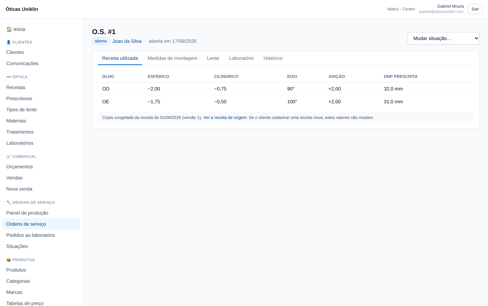

# Óticas Uniklin — SaaS de gestão para óticas

Plataforma multi-tenant para óticas: cadastro clínico e comercial, orçamento, venda,
ordem de serviço com controle óptico completo, laboratório, estoque, financeiro e
comissão.

**Stack:** React + TypeScript + Tailwind · Supabase (PostgreSQL, Auth, RLS, Edge
Functions).

## Estado atual

Banco, tipos e aplicação prontos. Falta criar o projeto Supabase e publicar —
veja [`docs/DEPLOY.md`](docs/DEPLOY.md).

```
db/
  migrations/   0001..0011  schema completo (Postgres 16 / Supabase)
  seeds/        catálogos de plataforma
  tools/        deploy.sh · validate.sh · smoke_api.sh · gen_types.py
src/
  types/        database.ts + domain.ts (gerados do schema) + testes de tipo
  auth/         sessão, permissões e filial ativa
  components/   kit de UI, DataTable e CrudPage dirigido por configuração
  pages/        os 9 módulos do mapa de menu
dev/            proxy local para rodar o app sem projeto Supabase
docs/
  DEPLOY.md     como pôr no ar, passo a passo
  arquitetura/  documentação de domínio + 11 ADRs
```



## Pôr no ar

```bash
export DATABASE_URL="postgresql://postgres.<ref>:<senha>@<host>:5432/postgres"
./db/tools/deploy.sh --seeds
```

Passo a passo completo (criar o projeto Supabase, aplicar o schema, criar a
primeira ótica, convidar a equipe): [`docs/DEPLOY.md`](docs/DEPLOY.md).

## Começando pela documentação

Leia [`docs/arquitetura/01-distincoes-de-dominio.md`](docs/arquitetura/01-distincoes-de-dominio.md).
É o documento que responde, ponto a ponto, às 12 distinções de domínio, com
referência ao ADR e ao arquivo de migration que implementa cada uma.

## Validando o schema

```bash
# requer psql apontando para um Postgres 14+ vazio
./db/tools/validate.sh
```

O script recria o banco, aplica migrations e seeds e executa o cenário completo do
item 12 do briefing (cliente → receita R1 → orçamento → venda PIX+cartão → O.S. com
snapshot → laboratório → estoque → financeiro → comissão → entrega → receita R2),
com 7 assertivas que falham em erro se a arquitetura não representar o cenário.

Resultado da última execução:
[`docs/arquitetura/03-cenario-de-validacao.md`](docs/arquitetura/03-cenario-de-validacao.md).

## Tipos TypeScript

```bash
npm run types:gen     # aplica o schema e regera src/types a partir do banco real
npm run types:check   # tsc --noEmit (inclui os testes de tipo)
```

Os tipos são **gerados por introspecção**, nunca escritos à mão, e carregam as
distinções de domínio para o compilador: a receita não aceita atributo de lente,
DNP clínica não é atribuível onde se espera DNP de montagem, e venda anônima não
tem cliente. Detalhes em
[`docs/arquitetura/06-tipos-typescript.md`](docs/arquitetura/06-tipos-typescript.md).

## Aplicando no Supabase

As migrations usam apenas o que o Supabase já oferece (`auth.users`, `auth.uid()`,
`pgcrypto`, `citext`). Aplique `db/migrations/*.sql` em ordem, depois
`db/seeds/*.sql`. **Não aplique** `db/tools/supabase_shim.sql` — ele existe só para
validação local, onde o schema `auth` não existe.

## Princípios não negociáveis

1. **Receita é prescrição clínica.** Lente, material, índice, tratamento,
   fabricante e preço não entram nela.
2. **A O.S. congela o que produziu.** Nova receita nunca altera produção passada.
3. **DNP, DNP de montagem e DP total são medidas distintas.**
4. **O cliente é do tenant.** A filial é proveniência e preferência, não dono.
5. **Não existe "Cliente Padrão".** Venda avulsa é anônima, com regras próprias.
6. **RLS no banco.** Validação de permissão nunca fica só no frontend.
