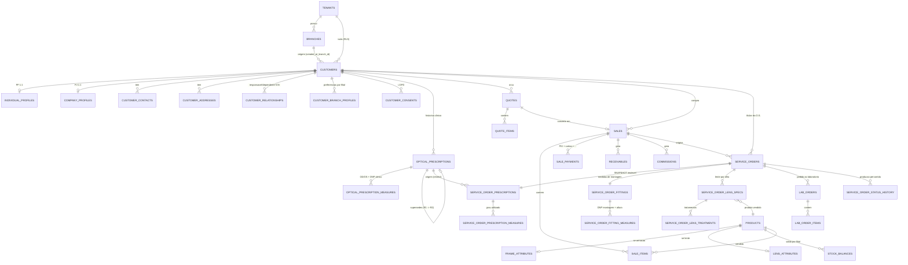
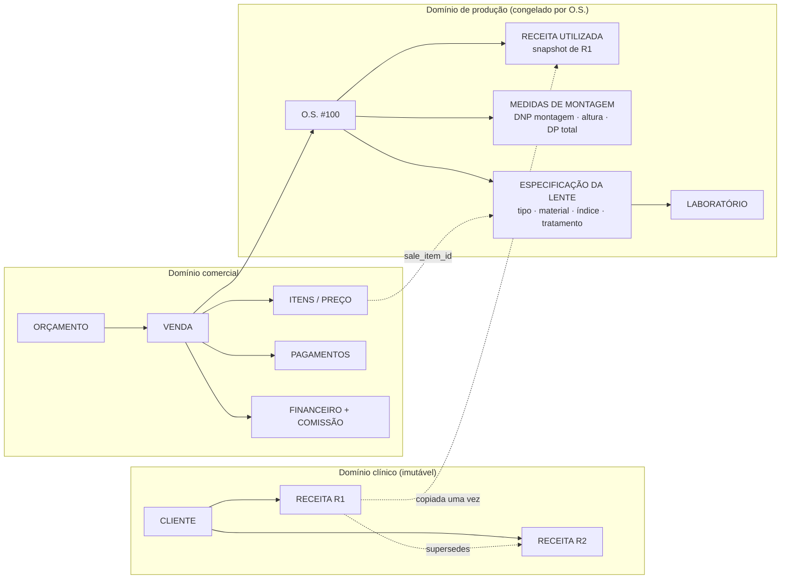

# Modelo de dados

PostgreSQL 16 (Supabase), multi-tenant com isolamento por RLS.
Migrations em `db/migrations/`, aplicadas em ordem numérica.

## Contextos

| # | Contexto | Migration | Responsabilidade |
|---|---|---|---|
| 1 | Núcleo | `0001` | Tenant, filiais, usuários, papéis, helpers de RLS |
| 2 | Catálogos | `0002` | Listas configuráveis, formas de pagamento, status de O.S., laboratórios, prescritores |
| 3 | Cliente | `0003` | Cliente PF/PJ, contatos, endereços, relacionamentos, LGPD, auditoria |
| 4 | Óptica clínica | `0004` | Receita e medidas por olho |
| 5 | Produtos | `0005` | Produtos, armações, lentes, preços, estoque |
| 6 | Comercial | `0006` | Orçamento, venda, pagamentos |
| 7 | Produção | `0007` | O.S., snapshot da receita, montagem, especificação da lente, laboratório |
| 8 | Financeiro | `0008` | A receber, a pagar, crédito do cliente, comissão |
| 9 | Segurança | `0009` | Políticas de RLS e grants |

## Fronteiras que não podem ser cruzadas

1. **Receita clínica ⇹ especificação de lente** (ADR-001).
   `optical_prescriptions` não referencia `products`, `lens_types`,
   `lens_materials`, `lens_treatments` nem `laboratories`.
2. **Receita viva ⇹ receita utilizada** (ADR-002).
   A O.S. lê `service_order_prescriptions`, nunca `optical_prescriptions`.
3. **Tenant ⇹ filial** (ADR-008).
   `customers` é do tenant; documentos operacionais são da filial.

## ERD — núcleo do domínio



## As três cadeias, lado a lado



A seta pontilhada `R1 → SNAP` é **cópia**, não referência viva. É por isso que R2
não altera a O.S. #100.

## Convenções

- **PK**: `uuid` com `gen_random_uuid()`. Nunca chave natural mutável.
- **Multi-tenancy**: `tenant_id` em toda tabela de negócio; FK composta
  `(entidade_id, tenant_id)` nas relações críticas, tornando *cross-tenant leak*
  impossível por construção, não por disciplina de código.
- **Soft delete**: `deleted_at` nas entidades de cadastro. Documentos fiscais e
  clínicos não são apagados — são cancelados ou substituídos.
- **Auditoria**: `created_at`, `updated_at` (trigger `tg_set_updated_at`),
  `created_by`/`updated_by`; `customer_audit_events` para o histórico do titular.
- **Dinheiro**: `numeric(12,2)`. Percentuais: `numeric(6,3)`.
- **Grau**: `numeric(5,2)` (esférico/cilíndrico), `numeric(4,2)` (adição),
  `numeric(4,1)` (medidas em mm), eixo `smallint 0–180`.
- **Olho**: `'OD'` / `'OS'` (nomenclatura clínica internacional), nunca
  `'esquerdo'` / `'direito'` em texto livre.

## RLS em duas camadas

```
permissiva  : tenant_id = current_tenant_id()          -> todo dado do tenant
restritiva  : user_can_access_branch(branch_id)        -> só documentos operacionais
restritiva  : has_permission('clinical.prescription.*')-> dado clínico (LGPD)
```

`customers` **não** entra na camada restritiva por filial: é o que permite a rede
enxergar o mesmo cliente em qualquer unidade (ADR-008).

Helpers (`0001`): `current_app_user_id()`, `current_tenant_id()`,
`current_branch_ids()`, `user_can_access_branch()`, `has_permission()` — todos
`SECURITY DEFINER` com `search_path` fixo. É a generalização do padrão
`public.get_loja_id()` usado nos outros projetos, separando tenant de filial.
